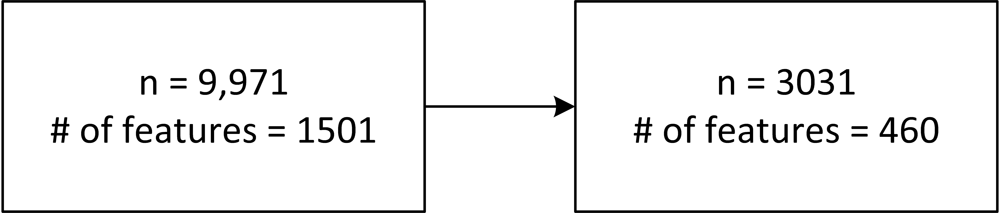
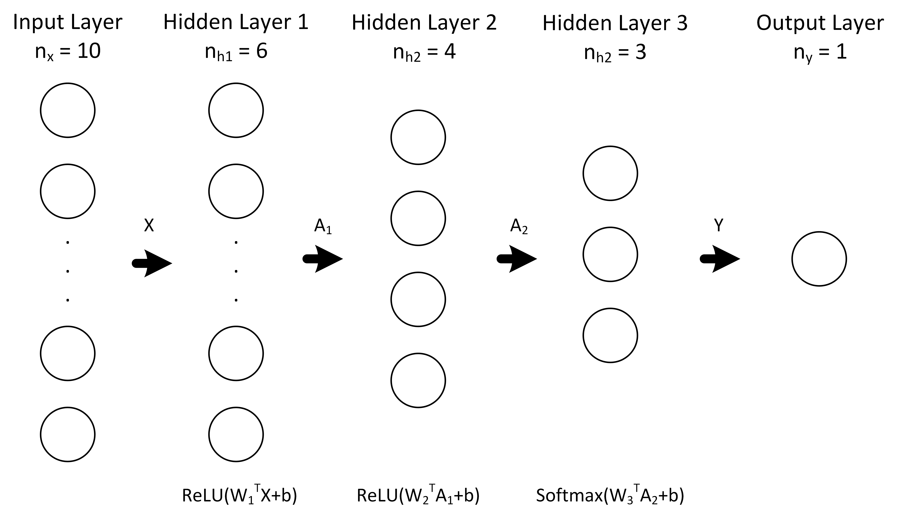

# Calorie Estimator
v 1.100

Calorie estimator based on NHANES diet data

In June 2019, I worked on a side project where I used the National Health and Nutrition Examination Surveys (NHANES) 2015-2016 to develop a calorie estimator. The NHANES conducted five sets of data collection, including demographics, dietary, physical examination, laboratory, and questionnaire data. This work examined the data to find patterns and used the findings to deploy classifiers to estimate the amount of calorie intake. This document consists of the following four sections.

1. [Getting Started](#Getting-Started)
1. [Data Cleaning and Joining](#Data-Cleaning-and-Joining)
1. [Exploratory Data Analysis](#Exploratory-Data-Analysis)
1. [Calorie Estimator Models](#Calorie-Estimator-Models)

## Getting Started

These instructions will get you a copy of the project up and running on your local machine for development and testing purposes.


### Prerequisites

The following are Python packages used in this project.

```
python                    3.7.5
scikit-learn              0.21.3
numpy                     1.17.4
xgboost                   0.90
tensorflow                2.0.0
seaborn                   0.9.0
matplotlib                3.1.1
statsmodels               0.10.2
pandas                    0.25.1
```

### Installing

You can use pip install package_name command to install each package on your local machine. I used Anaconda 3 on Windows 10. Some of these packages may exist already.

```
pip install statsmodels
pip install seaborn
pip install matplotlib
pip install xgboost      
pip install numpy     
pip install pandas    
pip install scikit-learn
pip install tensorflow       
```

### Folder Description
There are four directories in the repo. The following describes the details of the structure of the repo.

* /data

/data folder contains relevant data used for the analysis. Data formats are in CSV, Excel, and pickle. The folder divides into six subdirectories, which are raw, raw_formatted, clean, cleaned_df, data_for_model, and model. As the names suggest, raw and raw_formatted contains unprocessed data, clean and cleaned_df contain cleaned data, data_for_model contains final data used to build models, and model contains tuned models. 
* /images

This folder contains images generated throughout the analysis and ones used in this document. 
* /sheets

This folder contains Excel sheets containing some of the results from the analysis. 
* /scripts

/scripts folder contains Python files that were used to conduct the analysis. There are four subdirectories for each component of the system. 

/scripts/data_cleaning folder contains all python scripts used to clean and format the data.

/scripts/eda folder contains python scripts used to perform exploratory data analysis.

/scripts/model folder contains all python scripts used to select features and train models.

/script/archieve folder contains miscellaneous files from the previous developments.


## Data Cleaning and Joining
As mentioned above, the data are categorized into five types as the following.
-	Demographics data
-	Dietary data
-	Examination data
-	Laboratory data
-	Questionnaire data

The types that were used in this work were demographics, dietary, examination, and laboratory data. For brevity, the data types are hereafter referred to as demo, diet, exam, and lab data. Within each type, different tables of data existed. The link that connected the tables and types was the subject ID, which was used to combine the data. The cleaning and joining steps aimed to remove redundant information from the tables and join the tables across the different types to make one Pandas table.



After removing subjects who are less than or equal to 20 years of age or pregnant, 3031 subjects or samples remained.
Much of the information was redundant or supplementary to the main features, thus were removed from the analysis to reduce the number of features from 1501 to 460.
All tables were combined into a single Pandas DataFrame of size 3031 x 460 using the subject IDs as indices. 
All Python scripts used in this process are in /scripts/data_cleaning.

## Exploratory Data Analysis
### Correlation Between Features Across All Categories

Four hundred sixty features were correlated using ordinary linear regression. The heat map of the regression analysis is shown below. 


The heat map can be used to view the overall pattern; however, having 460 features makes it hard to read the details. Based on the examination of the correlation coefficients, no significant correlations were observed between features in different categories (e.g. cholesterol intake related to blood cholesterol level - diet and lab data). The closest relationship found was the mild correlation (i.e., r = 0.56) between the age and the number of missing teeth. 


### Closer Examination of Dietary Features

Because features across the categories did not reveal useful findings, one particular category was focused. Namely, diet data was used for the correlation analysis and later used for building the classifiers. 
Diet data contained 75 features, and the same correlation analysis as above was conducted. An MS Excel sheet with correlation coefficients is in /sheets/eda. Diet data was collected over a two-day period where the nutrient composition of the food intake was recorded. The data for each day was tabulated in a separate table. As many data samples were missing for the second day, only the data of the first day was used.
A few notable findings are listed below with actionable recommendations.

#### Protein and Phosphorus

The correlation coefficient between protein and phosphorus was 0.88 and the scatter plot of the data points (n = 3031) is shown below. 


Actionable recommendations include:

-	The intake of phosphorus should be limited if too much phosphorus is present within the body;
-	An alternative source of protein without phosphorus must also be recommended since many high-phosphorus foods are an important source of protein


#### Cholesterol Intake

It is not clear the cholesterol intake in the data label refers to high-density or low-density lipoprotein (i.e., cholesterol). High-density cholesterol is considered as a beneficial nutrient.
Two nutrients showed a high correlation with cholesterol. The correlation coefficient between cholesterol and ETA was 0.89, and that between cholesterol and Choline was 0.87. The findings support that the fact that the cholesterol was of a beneficial type as ETA is one of the omega-3 fatty acids usually taken as a food supplement and Choline is a nutrient that helps transport lipids such as ETA.


An actionable recommendation or, in this case, a better context of the data is that the cholesterol recorded was highly likely to be a high-density type and possibly be originating from food supplements.

The Python scripts used for the exploratory data analysis are contained in /scripts/eda/.

## Calorie Estimator Models

One of the features in the diet data was the total calorie intake. This feature was used as a label and machine learning models were created to estimate the amount of calorie intake based on the rest of the features.


### Class Generation
As the first step, the total calorie feature, which was a continuous variable, was converted into classes. Namely, the feature was sorted and divided into high, medium, and low classes. These classes were used as labels for the classifiers.

### Train and Test Set Generation
The samples were divided into stratified training and testing sets with the ration of 80 to 20%. Feature selection and model training was done based on the training set alone following by the evaluation of the model on the test set at the end.

### Missing Values
Every sample containing NaN values was removed from the analysis, after which, 2013 samples remained.

### Feature Selection
Seventy-four features were reduced to 11 features using backward elimination where features with a p-value less than 0.05 following the ordinary linear regression with the label were removed. 

### Classifiers
The training data set was used to create five different classifiers, which were four-layer neural network, gradient boosted decision trees (GB), random forest (RF), support vector machine (SVM), and naïve Bayes (NB) classifier. The neural network was trained using Adam optimization, mini-batch of 32, 1000 epochs, and learning rate of 0.0001. While the neural network was only trained once, GB, RF, and SVM were tuned first using random cross-validation followed by grid search cross-validation. The tuning parameters were omitted for brevity and can be accessed through the Python scripts. All scripts associated with the modelling are in /scripts/model/.




### Results
The table below shows the results of each classifier. GB and RF over-fitted the training data thus had a low test set accuracy whereas SVM and neural network showed the optimal performance. NB showed the lowest accuracies in both training and test sets.

| Method |	NN	| SVM | RF | GB |	NBC |
| --- | --- | --- | --- | --- | --- |
| Train set accuracy |	98.20% |	98.88% |	100.00% |	99.88% |	83.35% |
| Test set accuracy |	98.26% |	98.51% |	93.05% |	95.29% |	83.87% |

The tuned settings are listed below for the information.

### Model parameters

 - NN
 
Model: "sequential_1"

| Layer (type) | Output Shape | Param # |
|--|--|--|
| dense_3 (Dense) | multiple | 72 |
| dense_4 (Dense) | multiple | 28 |        
| dense_5 (Dense) | multiple | 15 |        

Total params: 115
Trainable params: 115
Non-trainable params: 0


- SVM

C=1040, cache_size=200, class_weight=None, coef0=0.0,
    decision_function_shape='ovr', degree=3, gamma=0.0002, kernel='linear',
    max_iter=-1, probability=False, random_state=None, shrinking=True,
    tol=0.001, verbose=False
    
- RF

'bootstrap': False, 'max_depth': 69, 'max_features': 'sqrt', 'min_samples_leaf': 1, 'min_samples_split': 5, 'n_estimators': 1580

- GB

base_score=0.5, booster='gbtree', colsample_bylevel=1,
              colsample_bynode=1, colsample_bytree=0.68,
              early_stopping_rounds=20, eval_metric='merror',
              gamma=1, learning_rate=0.051, max_delta_step=0,
              max_depth=4, min_child_weight=1, missing=nan, n_estimators=910,
              n_jobs=1, nthread=None, num_class=3, objective='multi:softprob',
              random_state=0, reg_alpha=0, reg_lambda=1, scale_pos_weight=1,
              seed=None, silent=None, subsample=0.84, verbosity=1

- NBC

priors=None, var_smoothing=1e-09


## Note
As of December 2019, I have uploaded v 1.100 to the GitHub. This repo will be expanded as I investigate the problem further. 
Updates

V 1.100 – December 2019
-	Deployed on GitHub
-	Codes cleaned, organized
-	SVM, XGBoost, naïve Bayes classifiers added

V 1.000 – June 2019
-	Data cleaning
-	Exploratory data analysis
-	Neural network model build


## Author

Isaac Sung Jae Chang is a fellow at Insight Data Science Program. Calorie Estimator was conducted as a side project. He recently finished his Ph.D. in biomedical engineering specialized in the physiological signal analysis and unobtrusive monitoring solutions. Visit his LinkedIn page to know more.
https://www.linkedin.com/in/isaac-chang/
